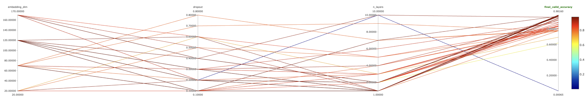

1) To get started
```
pip install -r requirments.txt
python data_featurization.py
python train.py

or python train.py --multirun ## hyperparameter sweep
```
## Model Performance:


Treating this model as a 6 class classification problem with the 6 classes being `Fully Paid`, `Charged Off`, `Current`, `In Grace Period` `Late (31-120 Days)` and `Late (16-30) days`
Accuracy (Percent Correct classified) was chosen as the final indicator. An Accuracy Score of 0.982 was achieved. Below is a confusion matrix showing what classes the model performed better on.


 

## Model Choice
 A very simple MLP Neural Network was chosen so that all categorical features could be treated as embeddings and low dimensional representations of them could be learned.
The model choice is rather naive but with proper hyperparameter tuning, good results can be achieved. Optuna was used to assist in hyperparameter tuning. A Parallel Coordinates plot is shown below 
to showcase the bredth of the search space


 

## Next Steps
Next steps on this model would be to add more hyperparameters such as learning rate as well as a more through architecture search. 
For the sake of simplicity only embedding dimensions and number of layers were considered. 
 Using more complex models such as TabNet more also improve model performance.
 
 
Other features such as zipcode and the corresponding relevant information (Average Wealth, Population Density, etc...) would probably provide usefull features as well.
